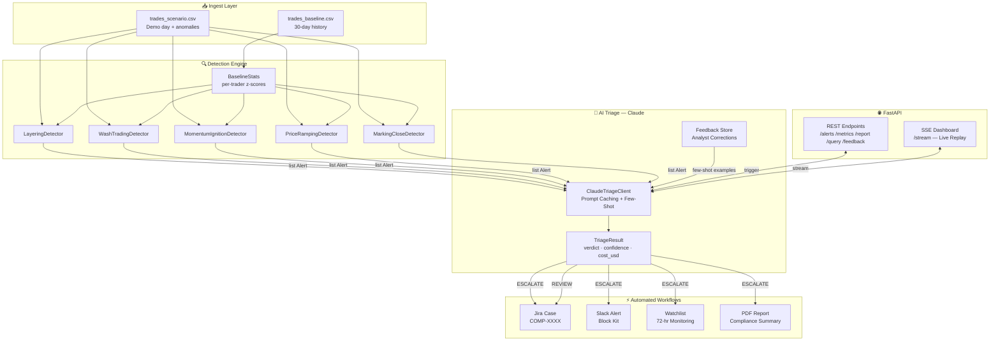

# Trade Surveillance & Alert Triage Engine

AI-powered trade surveillance system that ingests order/execution data, detects five
manipulation patterns using statistical anomaly detection, and triages every alert with
Claude using prompt caching for cost efficiency.

---

## Architecture



---

## Quick Start

### 1. Install dependencies
```bash
pip install -r requirements.txt
```

### 2. Configure environment
```bash
cp .env.example .env
# Edit .env — only ANTHROPIC_API_KEY is required for demo
```

### 3. Generate data
```bash
python data/generate_data.py
```
Outputs `data/trades_baseline.csv` (~440k events, 30 days) and `data/trades_scenario.csv`
(1 demo day with 4 injected anomalies).

### 4. Run end-to-end demo
```bash
python demo/run_demo.py
```
Expected output:
```
[STEP 1] Loading trade data...
  Baseline loaded: 442,903 events over 30 days
  Scenario loaded: 16,773 events (1 day + anomalies)

[STEP 2] Running pattern detection...
  Alert ID             Pattern                Inst   Trader   Sev        Z-Score
  TRD-20260217-0001    LAYERING               AAPL   T-4821   CRITICAL   +8.3σ
  TRD-20260217-0002    WASH_TRADING           MSFT   T-9033   HIGH       +4.1σ
  TRD-20260217-0003    MOMENTUM_IGNITION      TSLA   T-6610   HIGH       +3.8σ
  TRD-20260217-0004    PRICE_RAMPING          NVDA   T-8802   MEDIUM     +2.6σ

[STEP 3] AI Triage with Claude (4 alerts)...
  TRD-20260217-0001    ESCALATE      87%          8%      ✓ HIT
  TRD-20260217-0002    ESCALATE      79%          12%     ✓ HIT
  TRD-20260217-0003    REVIEW        71%          21%     ✓ HIT
  TRD-20260217-0004    REVIEW        64%          35%     ✓ HIT

[STEP 4] Triggering automated workflows...
  [Jira] Created ticket: COMP-8812
  [Slack] Message sent for TRD-20260217-0001
```

### 5. Run FastAPI server
```bash
uvicorn src.main:app --reload
```
API docs: http://localhost:8000/docs

---

## Detection Patterns

| Pattern                 | Trigger Thresholds                                                        | Severity        |
| ----------------------- | ------------------------------------------------------------------------- | --------------- |
| **Layering / Spoofing** | cancel_ratio ≥ 70%, median TTC ≤ 2s, opposite-side fill, z ≥ 2.5σ         | HIGH / CRITICAL |
| **Wash Trading**        | ≥ 3 matched BUY/SELL pairs, wash_fraction ≥ 20%, shared beneficial owner  | MEDIUM / HIGH   |
| **Momentum Ignition**   | ≥ 5 aggressive orders in 3 min, price move ≥ 0.5%, reversal within 10 min | MEDIUM / HIGH   |
| **Price Ramping**       | ≥ 4 executions, monotonicity ≥ 80%, price drift ≥ 0.3%, z ≥ 2.0σ          | MEDIUM / HIGH   |
| **Marking the Close**   | session=CLOSE, price drift ≥ 0.3%, trader fraction ≥ 40%, z ≥ 3.0σ        | HIGH            |

All patterns compute z-scores against each trader's own 30-day baseline statistics,
not a market-wide fixed threshold.

---

## Claude Triage Strategy

**Prompt caching** on the ~2,000-token domain knowledge system prompt (all 5 patterns +
false positive indicators) saves ~70% on input token costs for repeated triage calls.

| Alert Severity  | Triage Strategy           | Jira       | Slack        |
| --------------- | ------------------------- | ---------- | ------------ |
| CRITICAL / HIGH | One Claude call per alert | ✓          | ✓ (ESCALATE) |
| MEDIUM / LOW    | Batch up to 5 per call    | ✓ (REVIEW) | —            |
| DISMISS         | —                         | —          | —            |

**False positive discrimination:**
- `account_type = market_maker` + `market_maker_registered = True` → raise FP probability by 0.25-0.35 on layering alerts
- `account_type = fund` + `session = CLOSE` → raise FP probability on marking-the-close alerts
- Beneficial owner group flagged → lower FP probability on wash trading alerts

---

## API Endpoints

| Method | Endpoint              | Description                                        |
| ------ | --------------------- | -------------------------------------------------- |
| `POST` | `/ingest`             | Upload scenario CSV, run detection                 |
| `GET`  | `/alerts`             | List alerts (filter by severity, pattern, triaged) |
| `GET`  | `/alerts/{id}`        | Full alert + triage result                         |
| `POST` | `/alerts/{id}/triage` | Triage single alert with Claude                    |
| `GET`  | `/watchlist`          | Active enhanced-monitoring traders                 |
| `POST` | `/demo/run`           | Full pipeline on loaded data                       |
| `GET`  | `/metrics`            | Token usage, cache hit rate, alert counts          |

---

## Project Structure

```
hackathon3/
├── data/
│   ├── generate_data.py       # yfinance-based data generation + 4 anomaly injection
│   ├── trades_baseline.csv    # 30-day clean baseline (generated)
│   ├── trades_scenario.csv    # 1 demo day + 4 anomalies (generated)
│   ├── trader_profiles.csv    # account_type, market_maker_registered
│   └── related_accounts.csv  # trader_id → beneficial_owner_id
├── demo/
│   └── run_demo.py            # Standalone end-to-end demo (no FastAPI needed)
├── references/                # Research papers + dataset docs
│   ├── REFERENCES_INDEX.md
│   └── TT_Trade_Surveillance_Guide_v1.06.pdf  (primary reference)
├── src/
│   ├── config.py              # pydantic-settings env loader
│   ├── main.py                # FastAPI app + lifespan
│   ├── ingestion/
│   │   ├── schemas.py         # TradeEvent, Alert, TriageResult models
│   │   └── loader.py          # CSV → pydantic models
│   ├── detection/
│   │   ├── statistics.py      # Per-trader baseline + z-score
│   │   ├── engine.py          # Orchestrates all detectors
│   │   ├── layering.py
│   │   ├── wash_trading.py
│   │   ├── momentum_ignition.py
│   │   ├── price_ramping.py
│   │   └── marking_close.py
│   ├── triage/
│   │   ├── prompt_templates.py  # Cached system prompt + per-alert user prompt
│   │   └── claude_client.py     # Anthropic SDK, prompt caching, batching
│   ├── workflows/
│   │   ├── watchlist.py       # 72-hr enhanced monitoring
│   │   ├── jira_client.py     # Jira REST v3
│   │   └── slack_client.py    # Slack Incoming Webhook (Block Kit)
│   └── api/
│       └── routes.py          # All FastAPI endpoints
├── .env.example
└── requirements.txt
```

---

## Environment Variables

| Variable                      | Required | Description                          |
| ----------------------------- | -------- | ------------------------------------ |
| `ANTHROPIC_API_KEY`           | **Yes**  | Claude API key                       |
| `JIRA_BASE_URL`               | No       | e.g. `https://yourorg.atlassian.net` |
| `JIRA_API_TOKEN`              | No       | Jira Cloud API token                 |
| `JIRA_USER_EMAIL`             | No       | Account email for Jira auth          |
| `JIRA_PROJECT_KEY`            | No       | Default: `COMP`                      |
| `JIRA_L2_ASSIGNEE_ACCOUNT_ID` | No       | Jira account ID for L2 escalations   |
| `SLACK_WEBHOOK_URL`           | No       | Incoming webhook URL                 |
| `SLACK_CHANNEL`               | No       | Default: `#compliance-alerts`        |

Without Jira/Slack credentials, the system simulates both (prints to console) so the demo runs fully without external dependencies.

---

## References

All research materials are saved in `references/` — see [references/REFERENCES_INDEX.md](references/REFERENCES_INDEX.md).

Key sources:
- **TT Trade Surveillance Guide v1.06** — detection pattern taxonomy (80+ models)
- **arXiv 2403.13429** — validates rule-based detection + AI triage workflow
- **arXiv 2308.08683** — z-score baseline methodology for order book anomalies
- **arXiv 2309.00088** — limit order book as input + anomaly injection as research approach
- **NASDAQ ITCH Dataset** — free real exchange data schema reference
